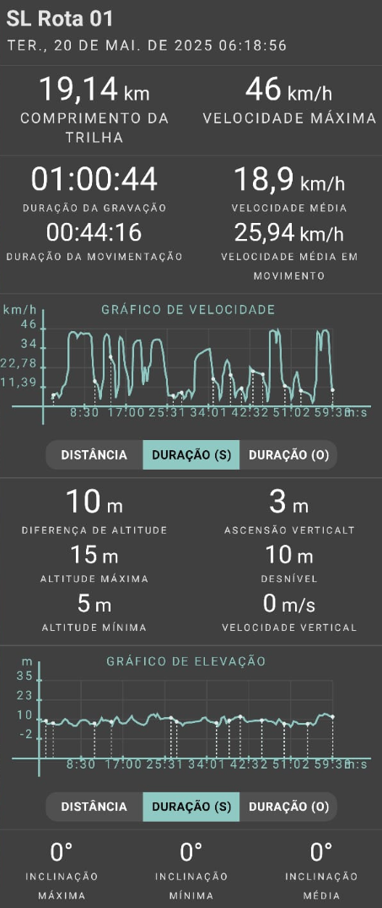
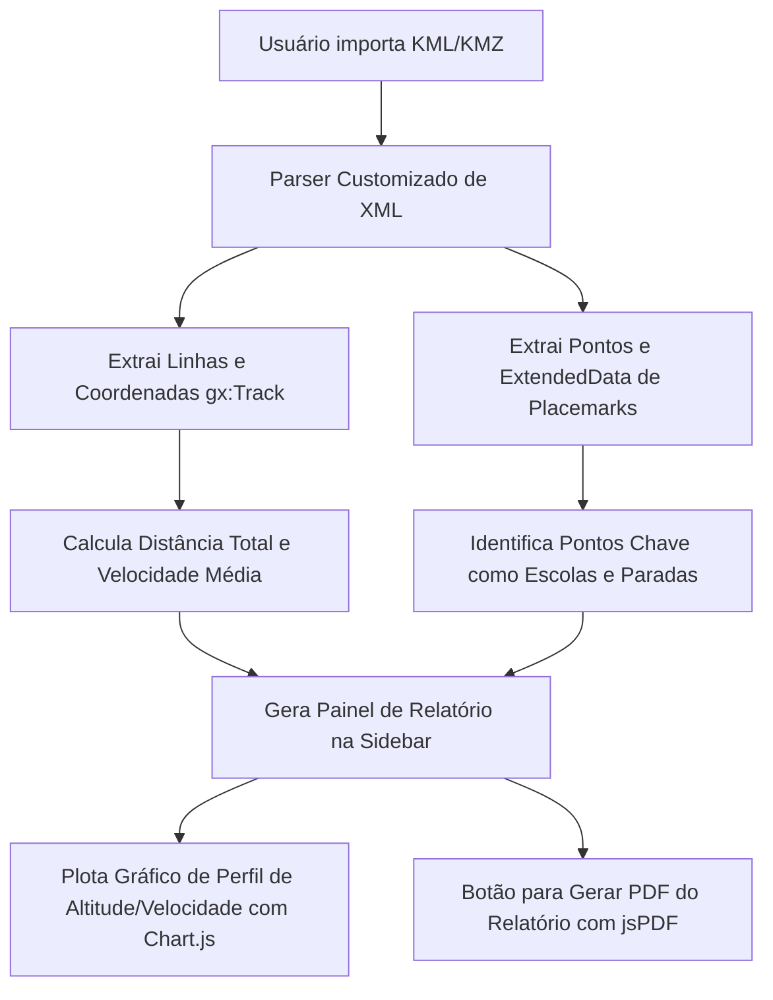

# Relatório Técnico Operacional: Visita de Campo à Escola Rural (SL Rota 01)

Este relatório apresenta a análise espacial e cronológica dos dados extraídos do arquivo KML **`SL_Rota_01.kml`** (gravado via aplicativo *Geo Tracker* em 20 de maio de 2025). O arquivo descreve a trajetória e os pontos de controle de uma visita técnica realizada pela equipe de Geotecnologia da Semed Manaus.

---

## 📊 Painel Analítico da Rota

A imagem a seguir apresenta a consolidação visual do trajeto, perfil de velocidade e principais indicadores de telemetria da rota analisada:



---

## 📈 Estatísticas Resumidas do Trajeto

Com base no cruzamento das tags `<gx:Track>` (geometria da linha) e `<Placemark>` (pontos de parada), consolidamos as seguintes métricas fundamentais:

| Métrica | Valor Extraído | Observação Técnica |
| :--- | :--- | :--- |
| **Nome da Rota** | SL Rota 01 | Identificador do trajeto fluvial/terrestre no Puraquequara. |
| **Data do Registro** | 20 de maio de 2025 | Visita realizada no período matutino. |
| **Horário de Início** | 10:19:12 UTC | Saída registrada no ponto inicial (`P inicial`). |
| **Horário de Término** | 11:19:07 UTC | Retorno e fechamento do track log (`P final`). |
| **Duração Total** | 59 min e 55 seg | Aproximadamente 1 hora de operação em campo. |
| **Distância Percorrida** | 19,14 km | Extensão total do deslocamento de ida e volta. |
| **Velocidade Média** | ~19,17 km/h | Compatível com navegação fluvial por motor de popa tipo rabeta/voadeira. |
| **Altitude Mínima** | 6,8 metros | Registrada próximo ao nível máximo da água da calha fluvial. |
| **Altitude Máxima** | 12,0 metros | Vértice em terra firme (cabeceiras/comunidade). |

---

## ⏱️ Cronologia de Visita e Pontos de Controle

A tabela a seguir detalha a sequência cronológica dos eventos registrados pelos marcos georreferenciados:

| Vértice | Horário | Distância do Início | Altitude | Descrição / Observação de Campo |
| :--- | :--- | :--- | :--- | :--- |
| **P inicial** | 10:19:12 | 0,00 km | 8,87 m | Ponto de partida da equipe técnica. Velocidade inicial: 0 km/h. |
| **P01 a P09** | 10:20 a 10:59 | 0,08 a 13,79 km | 7,5 a 12,0 m | Pontos de rastreamento contínuo em trânsito. Velocidades variando entre 2 km/h e 6,5 km/h. |
| **P Escola** | 11:02:44 | 14,36 km | 9,56 m | **Ponto de Interesse principal da visita**. Acesso direto à margem escolar. Velocidade de aproximação: 6,59 km/h. |
| **Parada de ~2 min** | 11:04:45 | 14,37 km | 10,50 m | Registro de parada técnica operacional. Indica o tempo em que a embarcação permaneceu atracada para entrega ou fiscalização. |
| **P10 a P11** | 11:05 a 11:12 | 14,39 a 16,93 km | 6,8 a 11,5 m | Trajeto de retorno da equipe ao ponto base. |
| **P final** | 11:19:07 | 19,14 km | 11,99 m | Encerramento do monitoramento técnico. |

---

## 💡 Modelo de Implementação Técnica no WebGIS

Para automatizar este tipo de análise diretamente no navegador do usuário ao importar qualquer KML ou KMZ contendo trajetos, propomos o seguinte **Modelo de Implementação de Relatório Automático** no aplicativo WebGIS:

### Fluxo de Funcionamento Proposto



### Componente HTML para Acoplamento na Sidebar
O módulo de KML na barra lateral pode ser estendido para exibir uma seção de **"Análise de Desempenho de Rota"** toda vez que uma rota de GPS for identificada no arquivo importado:

```html
<div class="route-analysis-card" id="route-analysis-card" style="display:none; margin-top:10px; padding:12px; background:rgba(0,0,0,0.3); border:1px solid var(--border-amber); border-radius:8px;">
  <div style="font-weight:700; color:var(--amber-light); font-size:11px; text-transform:uppercase; margin-bottom:8px;">Relatório de Viagem</div>
  <div style="font-size:12px; display:flex; justify-content:space-between; margin-bottom:4px;">
    <span>Distância Total:</span> <b id="route-dist-val">—</b>
  </div>
  <div style="font-size:12px; display:flex; justify-content:space-between; margin-bottom:4px;">
    <span>Duração da Rota:</span> <b id="route-time-val">—</b>
  </div>
  <div style="font-size:12px; display:flex; justify-content:space-between; margin-bottom:8px;">
    <span>Pontos de Parada:</span> <b id="route-stops-val">0</b>
  </div>
  <button class="btn sm" id="btn-show-chart" style="padding:6px; font-size:10px;">Visualizar Gráficos</button>
</div>
```

Este modelo permite que qualquer arquivo de log de GPS coletado em campo pelos técnicos seja imediatamente traduzido em métricas de produtividade administrativa e logística diretamente no mapa.
